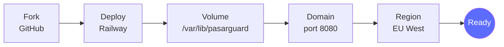
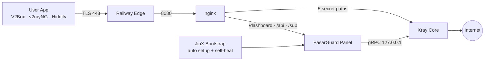
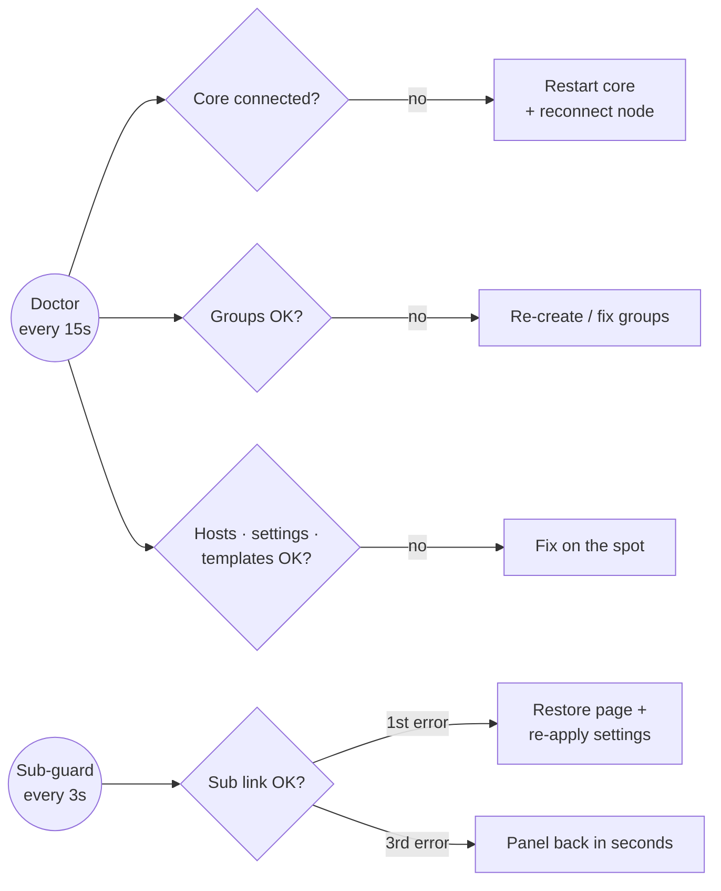

کد نویسی شده توسط تیم پمپ نت

<div align="center">


<a href="https://t.me/+WvKFv0lU_i5lNGE0"></a>

<h1>Super JinX Panel</h1>

<p><b>پنل نمایندگی حرفه‌ای، رایگان و متن‌باز بر پایه‌ی PasarGuard</b><br>
یک Fork تا یک سرویس کامل: پنل، هسته‌ی Xray و 5 کانفیگ آماده، همه روی Railway</p>

<a href="https://t.me/+WvKFv0lU_i5lNGE0"></a>


<br>


<br><br>

<a href="../../fork"></a>
<a href="https://railway.com/new"></a>

<br><br>

<a href="#preview"><b>پیش‌نمایش</b></a> &nbsp;·&nbsp;
<a href="#install"><b>نصب</b></a> &nbsp;·&nbsp;
<a href="#guides"><b>آموزش‌ها</b></a> &nbsp;·&nbsp;
<a href="#configs"><b>کانفیگ‌ها</b></a> &nbsp;·&nbsp;
<a href="#reseller"><b>نمایندگی</b></a> &nbsp;·&nbsp;
<a href="#fix"><b>عیب‌یابی</b></a> &nbsp;·&nbsp;
<a href="https://t.me/+WvKFv0lU_i5lNGE0"><b>کانال</b></a>

</div>

<br>

> [!NOTE]
> **Super JinX** کاملاً رایگانه. ریپو رو Fork کن، روی Railway بساز و در کمتر از 5 دقیقه پنل نمایندگی خودت رو تحویل بگیر. بدون VPS، بدون ترمینال، بدون تنظیم دستی.

<br>

> [!IMPORTANT]
> **تازه‌های نسخه‌ی 6.1.3:** صفحه‌ی اشتراک جدید JINX PASS دو زبانه · نگهبان ساب لینک 3 ثانیه‌ای · پینگ پایدارتر و مصرف رم کمتر · ربات پشتیبان خودکار که هر خرابی رو همونجا درست می‌کنه · تغییر رمز از داخل تنظیمات · بازیابی ورود با کلید مالک از صفحه‌ی ورود · قفل گروه‌ها و هاست‌ها در برابر حذف · کانفیگ‌های سریع‌تر · صفحه‌ی اشتراک مقاوم‌تر

<br>

<div align="center">

| <br>**1 سرویس** | <br>**5 کانفیگ** | <br>**2 گروه** | <br>**10 قالب فروش** | <br>**6 اپ** | <br>**خودترمیم** |
|:---:|:---:|:---:|:---:|:---:|:---:|
| پنل + Xray + nginx | 3 پروتکل، 2 انتقال | پرو و 𝗝𝗶𝗻𝗫 | آماده‌ی فروش | اتصال با یک لمس | 24 ساعته |

</div>

<br>

<a id="preview"></a>
##  &nbsp;پیش‌نمایش

<div align="center">


<sub>صفحه‌ی اشتراکی که مشتری‌هات می‌بینن: کارت هولوگرامی JINX PASS، پینگ زنده، QR داخلی و اتصال با یک لمس، به فارسی و انگلیسی</sub>

</div>

<br>

###  &nbsp;شروع سریع در 5 قدم



<br>

## فهرست مطالب

| | | |
|---|---|---|
| [پیش‌نمایش](#preview) | [معرفی](#intro) | [امکانات](#features) |
| [معماری](#arch) | [ساختار پروژه](#tree) | [English](#english) |
| [نصب](#install) | [آموزش‌ها](#guides) | [ورود و امنیت](#login) |
| [گروه‌ها و کانفیگ‌ها](#configs) | [اپ‌های پشتیبانی‌شده](#apps) | [پنل نمایندگی](#reseller) |
| [صفحه‌ی اشتراک](#sub) | [خودترمیمی](#heal) | [سرعت و پینگ](#speed) |
| [متغیرها](#vars) | [آپدیت](#update) | [عیب‌یابی](#fix) |
| [مستندات](#docs) | [همکاری](#collab) | [پشتیبانی](#support) |

<br>

<a id="intro"></a>
##  &nbsp;معرفی

**Super JinX** یک پنل نمایندگی کامل و آماده‌ی فروشه که روی [https://github.com/uxurx7rh7e7xr73uue73e8?tab=repositories.github.io/Amnezia-Wg/] ساخته شده. پنل، هسته‌ی Xray و وب‌سرور همه داخل **یک سرویس** روی Railway اجرا میشن و همه‌ی تنظیمات **خودکار** انجام میشه: اینباندها، هاست‌ها، گروه‌ها، قالب‌های فروش، نقش نماینده و صفحه‌ی اشتراک.

<a id="why"></a>
###  &nbsp;چرا Super JinX؟

| | پنل معمولی روی VPS | **Super JinX** |
|---|:---:|:---:|
| خرید سرور | لازم | **لازم نیست** |
| نصب با ترمینال | لازم | **لازم نیست** |
| ساخت اینباند و هاست | دستی | **خودکار** |
| گروه و قالب فروش | دستی | **آماده** |
| صفحه‌ی اشتراک اختصاصی | ندارد | **دارد** |
| بازگشت خودکار بعد از خطا | ندارد | **ربات پشتیبان 24 ساعته** |
| محافظت از گروه‌ها در برابر حذف | ندارد | **دارد** |
| تغییر و بازیابی رمز بدون ترمینال | ندارد | **دارد** |
| هزینه | ماهانه | **رایگان** |

<br>

<a id="features"></a>
##  &nbsp;امکانات

<table>
<tr>
<td width="50%" valign="top">

###  &nbsp;نصب بدون دردسر
- Fork و Deploy، بدون ویرایش حتی یک فایل
- پنل، هسته‌ی Xray و nginx در **یک سرویس**
- بدون نیاز به VPS یا نصب نود جداگانه
- همه چیز روی پورت `8080`

</td>
<td width="50%" valign="top">

###  &nbsp;کانفیگ‌های حرفه‌ای
- **5 کانفیگ** با 3 پروتکل: VLESS، Trojan و VMess
- دو نوع انتقال: WebSocket و HTTPUpgrade
- TLS روی پورت 443 با `alpn=http/1.1`
- Early Data (`ed=2560`) برای پینگ کمتر

</td>
</tr>
<tr>
<td valign="top">

###  &nbsp;سیستم نمایندگی
- نقش آماده‌ی **«نماینده»** با سهمیه‌ی حجم
- هر نماینده فقط کاربرهای خودش رو می‌بینه
- 10 قالب فروش آماده برای هر دو گروه
- منوی تمیز و ساده

</td>
<td valign="top">

###  &nbsp;صفحه‌ی اشتراک اختصاصی
- کارت هولوگرامی **JINX PASS** با انیمیشن نرم
- دو زبانه‌ی فارسی و انگلیسی، همه‌ی عددها انگلیسی
- پینگ زنده‌ی سرور، **QR داخلی** و اتصال سریع
- اتصال با یک لمس به 6 اپ محبوب

</td>
</tr>
<tr>
<td valign="top">

###  &nbsp;ربات پشتیبان و پایداری
- **ربات پشتیبان خودکار** داخل سرور، بدون هیچ دکمه‌ی اضافه
- هر 1 دقیقه: هسته و گروه‌ها · هر 5 دقیقه: هاست‌ها، اشتراک، قالب‌ها
- **نگهبان ساب لینک**: تست هر 3 ثانیه و تعمیر در چند ثانیه
- گروه‌ها، هاست‌ها و هسته در برابر حذف **قفل** هستن

</td>
<td valign="top">

###  &nbsp;امنیت
- مسیرهای کانفیگ **اختصاصی برای هر نصب**
- همه‌ی پورت‌های داخلی فقط روی `127.0.0.1`
- **تغییر رمز عبور از داخل تنظیمات**، با تأیید رمز فعلی
- سازگار با **همه‌ی زبان‌های پنل** (فارسی، انگلیسی، روسی، چینی) و **حالت روز و شب**
- **بازیابی ورود** با کلید یک‌بار مصرف 5 دقیقه‌ای
- قفل 10 دقیقه‌ای بعد از 5 تلاش اشتباه

</td>
</tr>
</table>

<br>

<a id="arch"></a>
##  &nbsp;معماری



<br>

<a id="install"></a>
##  &nbsp;نصب

> [!TIP]
> زمان نصب حدود **5 دقیقه**ست. فقط یک اکانت [GitHub](https://github.com) و یک اکانت [Railway](https://railway.com) لازم داری.

<details open>
<summary><b>مرحله‌ی 1 &nbsp;·&nbsp; Fork کردن ریپو</b></summary>

<br>

1. بالای همین صفحه روی **Fork** بزن.
2. اسم ریپو رو هر چی خواستی بذار و **Create fork** رو بزن.
3. حالا یک نسخه از پروژه توی اکانت خودت داری. هیچ فایلی رو لازم نیست تغییر بدی.

</details>

<details open>
<summary><b>مرحله‌ی 2 &nbsp;·&nbsp; ساخت سرویس روی Railway</b></summary>

<br>

1. وارد [Railway](https://railway.com) شو و بزن **New Project**.
2. گزینه‌ی **Deploy from GitHub repo** رو انتخاب کن و ریپوی Fork شده‌ی خودت رو بزن.
3. Railway خودش شروع به ساختن می‌کنه. صبر کن تا مرحله‌ی بعد.

</details>

<details open>
<summary><b>مرحله‌ی 3 &nbsp;·&nbsp; اتصال Volume (خیلی مهم)</b></summary>

<br>

1. روی سرویس **راست‌کلیک** کن (روی گوشی: نگه دار) و **Attach Volume** رو بزن.
2. مسیر رو دقیقاً این بذار:

```text
/var/lib/pasarguard
```

> [!IMPORTANT]
> بدون Volume با هر ری‌استارت همه‌ی کاربرها و تنظیمات پاک میشن.

</details>

<details open>
<summary><b>مرحله‌ی 4 &nbsp;·&nbsp; دامنه و پورت</b></summary>

<br>

1. برو **Settings ← Networking**.
2. بزن **Generate Domain** و پورت رو **`8080`** بذار.
3. یک آدرس مثل `xxxx.up.railway.app` می‌گیری. این آدرس پنلته.

</details>

<details open>
<summary><b>مرحله‌ی 5 &nbsp;·&nbsp; Region و اجرای دوباره</b></summary>

<br>

1. برو **Settings ← Deploy ← Region** و **EU West (Amsterdam)** رو انتخاب کن (بهترین پینگ برای ایران).
2. از تب **Deployments** یک بار **Redeploy** بزن.
3. توی **Deploy Logs** این خط یعنی همه چیز آماده‌ست:

```text
[bootstrap] DONE -> https://YOUR-DOMAIN/dashboard/
```

</details>

> [!NOTE]
> **هر نصب، مسیرهای اختصاصی خودش رو داره.** موقع اولین اجرا مسیر هر 5 کانفیگ تصادفی ساخته میشه و روی Volume می‌مونه. هر Fork روی سرور جداگانه‌ی خودش اجرا میشه، پس پنل‌ها هیچ منبعی رو با هم شریک نیستن و از سرعت هم کم نمی‌کنن.

<br>

<a id="guides"></a>
##  &nbsp;آموزش‌ها

<details>
<summary><b>اولین ورود به پنل</b></summary>

<br>

1. آدرس `https://YOUR-DOMAIN/dashboard/` رو باز کن.
2. با `admin` و رمز `admin` وارد شو.
3. **همون اول رمز رو عوض کن**: **تنظیمات ← تغییر رمز عبور** (آموزش بعدی).

</details>

<details>
<summary><b>تغییر رمز عبور از تنظیمات</b></summary>

<br>

1. توی پنل برو **«تنظیمات»**. بالای صفحه کارت **«تغییر رمز عبور»** هست.
2. **نام کاربری فعلی** و **رمز عبور فعلی** رو وارد کن.
3. اگه خواستی **نام کاربری جدید** رو هم بنویس (خالی بذاری، همون قبلی می‌مونه).
4. **رمز عبور جدید** و تکرارش رو بنویس و **«ثبت رمز جدید»** رو بزن. هر رمزی که بخوای قبول میشه، حتی کوتاه یا فارسی.
5. پنل خودکار خارج میشه. از این به بعد با اطلاعات جدید وارد شو.

مالک و نماینده‌ها هر کدوم اکانت خودشون رو از همینجا عوض می‌کنن. رمز فعلی مستقیم توی دیتابیس پنل چک میشه و بعد از ذخیره هم دوباره تأیید میشه. بعد از 5 بار رمز اشتباه، 10 دقیقه قفل میشه (فقط برای همون شخص).

</details>

<details>
<summary> &nbsp;<b>بازیابی رمز با کلید 5 دقیقه‌ای مالک</b></summary>

<br>

1. توی پنل برو **«کلیدهای API»**. بالای صفحه بخش **«کلید 5 دقیقه‌ای مالک»** هست.
2. روی **«دریافت کلید»** بزن و کلید رو کپی کن.
3. از پنل خارج شو و توی صفحه‌ی ورود دکمه‌ی **«دسترسی مالک»** رو بزن.
4. توی پنجره‌ای که باز میشه، کلید رو پیست کن، نام کاربری و رمز جدید (دو بار) رو بذار و **«ثبت اطلاعات جدید»** رو بزن.
5. با نام کاربری و رمز جدید وارد شو.

رمز یادت رفته؟ سرویس رو توی Railway **Restart** کن و کلید رو از خط **`OWNER KEY`** توی لاگ بردار.

</details>

<details>
<summary><b>ساخت کاربر و فروش اشتراک</b></summary>

<br>

1. برو **کاربران ← ساخت کاربر**.
2. یک **نام کاربری** بنویس.
3. از بخش قالب، یکی رو انتخاب کن. مثلاً `30GB - 30 روز` (گروه 𝗝𝗶𝗻𝗫، 4 کانفیگ) یا `Pro 30GB - 30 روز` (گروه جینکس پرو، 1 کانفیگ).
4. ذخیره کن. حجم، تاریخ انقضا و کانفیگ‌ها خودکار تنظیم میشن.
5. روی کاربر بزن و **لینک اشتراک** رو کپی کن و برای مشتری بفرست.

</details>

<details>
<summary><b>وصل شدن با V2Box (iOS و Android)</b></summary>

<br>

1. لینک اشتراک رو توی مرورگر گوشی باز کن.
2. بزن **«افزودن به اپ با یک لمس»** و **V2Box** رو انتخاب کن.
3. توی V2Box کانفیگ‌ها اضافه میشن. یکی رو انتخاب کن و وصل شو.
4. اگه عدد پینگ قرمز بود ولی وصل شد، نگران نباش: برو تنظیمات V2Box و آدرس تست رو بذار روی `http://cp.cloudflare.com/generate_204` (با http). عدد واقعی‌تر و کمتر نشون میده.
5. برای تست پینگ از **Real Delay / URL Test** استفاده کن، نه TCP.

</details>

<details>
<summary><b>وصل شدن با v2rayNG (Android)</b></summary>

<br>

1. لینک اشتراک رو کپی کن.
2. توی v2rayNG از منوی بالا **Subscription group setting** رو باز کن و **+** بزن.
3. لینک رو توی **URL** پیست کن و ذخیره کن.
4. برگرد، از منو **Update subscription** رو بزن و یکی از کانفیگ‌ها رو انتخاب کن.

</details>

<details>
<summary><b>وصل شدن با Hiddify، Streisand، Happ و NekoBox</b></summary>

<br>

1. لینک اشتراک رو توی مرورگر باز کن.
2. بزن **«افزودن به اپ با یک لمس»** و اپ خودت رو انتخاب کن.
3. اشتراک خودکار اضافه میشه. اگه اپ باز نشد، لینک رو کپی کن و توی اپ از بخش **Add / Import from clipboard** اضافه کن.

</details>

<details>
<summary><b>ساخت نماینده</b></summary>

<br>

1. با اکانت مالک برو **مدیران ← افزودن مدیر** (این منو فقط برای مالک دیده میشه).
2. نقش رو **«نماینده»** بذار و سهمیه‌ی حجم رو مشخص کن (مثلاً **50 GB**).
3. یوزر و رمز رو به نماینده بده. نماینده فقط کاربرهای خودش رو می‌بینه و فقط با قالب‌ها کاربر می‌سازه.

</details>

<details>
<summary><b>آپدیت پنل به نسخه‌ی جدید</b></summary>

<br>

1. توی ریپوی خودت روی گیتهاب بزن **Sync fork ← Update branch**.
2. Railway خودکار Deploy می‌کنه. کاربرها، رمزها و کانفیگ‌ها دست نمی‌خورن.

</details>

<br>

<a id="login"></a>
##  &nbsp;ورود و امنیت

| نقش | آدرس | نام کاربری | رمز |
|---|---|---|---|
| **مالک** | `https://YOUR-DOMAIN/dashboard/` | `admin` | `admin` |
| **نماینده‌ی نمونه** (50 گیگ) | `https://YOUR-DOMAIN/dashboard/` | `reseller` | `reseller` |

> [!WARNING]
> `admin` / `admin` فقط برای **اولین ورود** هست. همون اول رمز مالک رو عوض کن و رمز نماینده‌ی نمونه رو هم تغییر بده یا پاکش کن (دیگه ساخته نمیشه). رمزی که خودت بذاری هیچ وقت خودکار عوض نمیشه.

<br>

<a id="configs"></a>
##  &nbsp;گروه‌ها و کانفیگ‌ها

| گروه | کانفیگ | پروتکل | انتقال | اثرانگشت TLS | ویژگی |
|---|---|---|---|---|---|
| **جینکس پرو** | 𝗣𝗿𝗼 | VLESS | WebSocket + Early Data | Chrome | تک‌کانفیگ با کمترین پینگ |
| **𝗝𝗶𝗻𝗫** | ⚡ 𝗙𝗹𝗮𝘀𝗵 | VLESS | WebSocket | Firefox | سریع و سبک |
| | 🔥 𝗙𝗶𝗿𝗲 | Trojan | WebSocket | Safari | مناسب iOS |
| | 💎 𝗗𝗶𝗮𝗺𝗼𝗻𝗱 | VMess | WebSocket | Edge | سازگاری با اپ‌های قدیمی |
| | 🌙 𝗡𝗶𝗴𝗵𝘁 | VLESS | HTTPUpgrade | iOS | پایدار در شبکه‌های سخت |

اسم کانفیگ‌ها توی اپ کاربر با فونت مخصوص دیده میشه:

```text
𝗣𝗿𝗼 | جینکس | 𝙎𝙪𝙥𝙚𝙧 𝗝𝗶𝗻𝗫
⚡ 𝗙𝗹𝗮𝘀𝗵 | جینکس | 𝙎𝙪𝙥𝙚𝙧 𝗝𝗶𝗻𝗫
🔥 𝗙𝗶𝗿𝗲 | جینکس | 𝙎𝙪𝙥𝙚𝙧 𝗝𝗶𝗻𝗫
💎 𝗗𝗶𝗮𝗺𝗼𝗻𝗱 | جینکس | 𝙎𝙪𝙥𝙚𝙧 𝗝𝗶𝗻𝗫
🌙 𝗡𝗶𝗴𝗵𝘁 | جینکس | 𝙎𝙪𝙥𝙚𝙧 𝗝𝗶𝗻𝗫
```

متن بعد از اسم رو با متغیر `CONFIG_TITLE` هر چی بخوای عوض کن.

> [!TIP]
> اگه موقع ساخت کاربر گروهی انتخاب نکنی، پنل خودکار اون رو به گروه **𝗝𝗶𝗻𝗫** وصل می‌کنه.

**لینک اشتراک**

```text
https://YOUR-DOMAIN/sub/<token>
```

<a id="apps"></a>
###  &nbsp;اپ‌های پشتیبانی‌شده

| اپ | Android | iOS | Windows | اتصال با یک لمس |
|---|:---:|:---:|:---:|:---:|
| **V2Box** | ✓ | ✓ | | ✓ |
| **v2rayNG** | ✓ | | | ✓ |
| **Hiddify** | ✓ | ✓ | ✓ | ✓ |
| **Streisand** | | ✓ | | ✓ |
| **Happ** | ✓ | ✓ | ✓ | ✓ |
| **NekoBox** | ✓ | | ✓ | ✓ |
| **Clash Meta / sing-box** | ✓ | ✓ | ✓ | |

<br>

<a id="reseller"></a>
##  &nbsp;پنل نمایندگی

| گروه | قالب‌های فروش آماده |
|---|---|
| **𝗝𝗶𝗻𝗫** | 10، 30، 50 و 100 گیگ (30 روزه) · 200 گیگ (60 روزه) · نامحدود (30 روزه) |
| **جینکس پرو** | Pro 30، 50 و 100 گیگ · Pro نامحدود (همه 30 روزه) |

**منوی پنل**: داشبورد · کاربران · کلیدهای API · قالب‌ها · عملیات گروهی · تنظیمات · پشتیبانی

نماینده‌ها فقط کاربرهای خودشون رو می‌بینن، فقط با قالب‌ها کاربر می‌سازن و با تموم شدن سهمیه‌شون خودکار محدود میشن.

<br>

<a id="sub"></a>
##  &nbsp;صفحه‌ی اشتراک

- کارت هولوگرامی **JINX PASS** با نام کاربر، وضعیت، تاریخ انقضا و زمان باقی‌مانده
- **دو زبانه**: فارسی و انگلیسی با یک لمس، راست‌چین و چپ‌چین خودکار، همه‌ی عددها به شکل 123
- تاریخ انقضا به **تقویم شمسی** و هشدار نزدیک شدن به پایان حجم یا زمان
- حلقه‌ی مصرف با حجم مصرف‌شده، باقی‌مانده و کل حجم
- **پینگ زنده‌ی سرور** از گوشی کاربر با برچسب کیفیت و آنتن
- لینک اشتراک با **QR داخلی** (لوگوی جینکس وسطش) و کپی همه‌ی کانفیگ‌ها
- اتصال با یک لمس به V2Box، v2rayNG، Hiddify، Streisand، Happ و NekoBox، با دکمه‌ی شناور «اتصال سریع»
- فهرست کانفیگ‌ها با آیکون اختصاصی، برچسب پروتکل، QR هر کانفیگ و کپی سریع
- سبک و روان روی گوشی‌های ضعیف هم (60 فریم)، بدون هیچ سرویس بیرونی

<br>

<a id="heal"></a>
##  &nbsp;ربات پشتیبان و خودترمیمی

ربات پشتیبان Super JinX داخل خود سرور اجرا میشه، توی پنل هیچ دکمه‌ای نداره و همه‌ی کارهاش رو توی لاگ Railway با کلمه‌ی `doctor` ثبت می‌کنه.



| مشکل | واکنش خودکار پنل |
|---|---|
| قطع شدن هسته‌ی Xray | ری‌استارت خودکار هسته و اتصال دوباره‌ی نود |
| جواب ندادن پنل یا nginx به مدت 3 دقیقه | ری‌استارت کامل سرویس |
| خطا در اسکریپت راه‌اندازی | اجرای دوباره‌ی خودکار بعد از 10 ثانیه |
| تغییر یا حذف اشتباهی گروه‌ها و هاست‌ها | بررسی هر 1 دقیقه (گروه‌ها) و 5 دقیقه (هاست‌ها) و اصلاح خودکار |
| ساخت کاربر بدون گروه | اتصال خودکار به گروه 𝗝𝗶𝗻𝗫 |
| حذف یا تغییر گروه‌ها، هاست‌ها، هسته و نقش‌ها از بیرون | **قفل**: از پنل و API فقط قابل دیدنه، نه پاک کردن |
| خراب شدن لینک‌های اشتراک | **نگهبان ساب** هر 3 ثانیه لینک رو مثل یه کاربر واقعی باز می‌کنه؛ خطای اول: فایل صفحه و تنظیمات اشتراک همون لحظه درست میشه، خطای سوم: پنل ری‌استارت میشه و چند ثانیه بعد برمی‌گرده |
| پاک یا خراب شدن فایل صفحه‌ی اشتراک | برگردوندن نسخه‌ی اصلی در کمتر از 3 ثانیه |
| از کار افتادن پنل، nginx یا هسته | دوباره روشن شدن خودکار در 1 ثانیه، بدون ری‌استارت کل سرویس |
| لحظه‌ی ری‌استارت پنل | اپ‌ها جواب «3 ثانیه دیگه» می‌گیرن و کانفیگ‌های قبلی‌شون سر جاش می‌مونه؛ مرورگر هم خودش صفحه رو دوباره باز می‌کنه |

<br>

<a id="speed"></a>
##  &nbsp;سرعت و پینگ

| تنظیم | اثر |
|---|---|
| Region روی **EU West (Amsterdam)** | کوتاه‌ترین مسیر تا ایران |
| Early Data (`ed=2560`) | یک رفت‌وبرگشت کمتر در هر اتصال |
| `alpn=http/1.1` | سازگار با لبه‌ی Railway، بدون مذاکره‌ی اضافه |
| مسیریابی `AsIs` بدون DNS اضافه | یک رفت‌وبرگشت کمتر سر هر اتصال جدید |
| DNS خود سرور با کش | جواب DNS تقریباً فوری |
| WebSocket بدون بافر | آپلود و دانلود بدون معطلی |
| اتصال‌های Keep-Alive در nginx | پنل و اشتراک سریع‌تر باز میشن |

**پینگ واقعی، بدون اغراق** (سرور در EU West):

| نوع تست در اپ | چی رو می‌سنجه | عدد معمول |
|---|---|:---:|
| **TCP Ping** | فقط رسیدن به سرور | 80 تا 120 ms |
| **Real Delay** روی اینترنت خوب | اتصال کامل + باز کردن یک سایت | 150 تا 250 ms |
| **Real Delay** روی اینترنت همراه | همون، روی شبکه‌ی موبایل | 250 تا 400 ms |

> [!TIP]
> توی تنظیمات V2Box آدرس تست رو بذار روی `http://cp.cloudflare.com/generate_204` (با http). قرمز بودن عدد یعنی فقط از حد سلیقه‌ای اپ بیشتره، نه اینکه کانفیگ خرابه. ملاک واقعی سرعت باز شدن سایت‌ها و ویدیوهاست.

<br>

<a id="vars"></a>
##  &nbsp;متغیرهای اختیاری

هیچ متغیری الزامی نیست. از **Variables** سرویس در Railway اضافه‌شون کن:

| متغیر | پیش‌فرض | کاربرد |
|---|---|---|
| `CONFIG_TITLE` | `جینکس \| 𝙎𝙪𝙥𝙚𝙧 𝗝𝗶𝗻𝗫` | متنی که بعد از اسم هر کانفیگ دیده میشه |
| `SUBSCRIPTION_PATH` | `sub` | مسیر لینک اشتراک |
| `PUBLIC_DOMAIN` | دامنه‌ی Railway | فقط برای دامنه‌ی شخصی یا Cloudflare |
| `DEMO_RESELLER` | `on` | با `off` نماینده‌ی نمونه ساخته نمیشه |

<br>

<a id="update"></a>
##  &nbsp;آپدیت

توی ریپوی خودت روی **Sync fork ← Update branch** بزن. Railway خودکار Deploy می‌کنه و **کاربرها، رمزها و کانفیگ‌ها دست نمی‌خورن.** هر Redeploy آخرین نسخه‌ی PasarGuard و Xray رو هم می‌گیره.

<br>

<a id="fix"></a>
##  &nbsp;عیب‌یابی

| خطا | راه‌حل |
|---|---|
| `Application failed to respond` | پورت دامنه رو **8080** بذار |
| کانفیگ‌ها وصل نمیشن | دامنه بعد از اولین Deploy ساخته شده، یک بار **Redeploy** کن |
| کاربرها بعد از Deploy پاک شدن | Volume روی `/var/lib/pasarguard` وصل نیست |
| `Incorrect username or password` | یک دقیقه صبر کن تا سرویس کامل بالا بیاد |
| پینگ قرمز ولی وصل میشه | تست TCP رو کنار بذار و از **Real Delay** استفاده کن |

راهنمای کامل: [https://t.me/PompNett) · سوال‌های رایج: [https://github.com/uxurx7rh7e7xr73uue73e8?tab=repositories.github.io/Amnezia-Wg/)

<br>

<details>
<summary><b>سوال‌های پرتکرار</b></summary>

<br>

**اگه بقیه هم از این ریپو بسازن، سرعت پنل من کم میشه؟**
نه. هر Fork روی سرور جداگانه‌ی خودش با CPU، رم و اینترنت جدا اجرا میشه.

**پینگ دقیقاً چقدر میشه؟**
با Real Delay روی اینترنت خوب حدود 150 تا 250 میلی‌ثانیه و با TCP Ping حدود 80 تا 120، به شرطی که Region روی EU West باشه.

**چرا پینگ واقعی 80 نمیشه؟**
فقط فاصله‌ی ایران تا آمستردام حدود 80 تا 120 میلی‌ثانیه‌ست و Real Delay چند مرحله‌ی اتصال رو هم روش حساب می‌کنه. همه‌ی بهینه‌سازی‌های ممکن (Early Data، DNS کش‌شده، مسیریابی بدون جستجوی اضافه) از قبل فعالن.

**هزینه داره؟**
پروژه کاملاً رایگانه. فقط هزینه‌ی خود Railway (طبق پلنی که داری) پای خودته.

**رمزم یادم رفت؟**
سرویس رو Restart کن، کلید رو از خط `OWNER KEY` لاگ بردار و توی صفحه‌ی ورود دکمه‌ی «دسترسی مالک» رو بزن.

**کسی می‌تونه گروه‌ها رو پاک کنه؟**
نه. گروه‌ها، هاست‌ها، هسته و نقش‌ها از بیرون قفل هستن و اگه هم به هر دلیلی خراب بشن، ربات پشتیبان درستشون می‌کنه.

</details>

<br>

<a id="tree"></a>
##  &nbsp;ساختار پروژه

<details>
<summary><b>همه‌ی فایل‌ها و کار هر کدوم</b></summary>

<br>

| فایل | کار |
|---|---|
| `Dockerfile` | ساخت یک ایمیج از PasarGuard + نود Xray + nginx |
| `railway.json` | تنظیمات Deploy و Health Check روی Railway |
| `entrypoint.sh` | راه‌اندازی همه‌ی سرویس‌ها و روشن کردن دوباره‌ی هر کدوم در 1 ثانیه |
| `bootstrap.py` | تنظیم خودکار پنل، ربات پشتیبان، نگهبان ساب، کلید مالک و تغییر رمز |
| `genpaths.py` | ساخت مسیرهای اختصاصی کانفیگ برای هر نصب |
| `nginx.conf.template` · `ws.inc` | وب‌سرور، قفل‌ها، صفحه‌ی آماده‌سازی ساب و تنظیمات WebSocket |
| `jinx-ui.js` | منوی تمیز پنل، کارت تغییر رمز، کلید مالک و پنجره‌ی «دسترسی مالک» |
| `sub.html` | صفحه‌ی اشتراک JINX PASS |
| `healthcheck.sh` | تست سلامت پنل و nginx |
| `env.example` | نمونه‌ی متغیرهای اختیاری |
| `*.md` · `*.svg` · `preview.png` | مستندات، آیکون‌ها و تصویر پیش‌نمایش |

</details>

<br>

<a id="english"></a>
##  &nbsp;English

<details>
<summary><b>Super JinX in English</b></summary>

<br>

**Super JinX** is a free, ready-to-sell reseller panel built on [PasarGuard](https://github.com/uxurx7rh7e7xr73uue73e8?tab=repositories.github.io/Amnezia-Wg/). The panel, the Xray core and nginx run in **one Railway service**, and everything is configured automatically: inbounds, hosts, groups, sales templates, reseller role and a custom subscription page.

- **Install:** Fork → Railway *Deploy from GitHub repo* → attach a Volume at `/var/lib/pasarguard` → Generate Domain on port `8080` → Region *EU West* → Redeploy
- **First login:** `admin` / `admin` at `https://YOUR-DOMAIN/dashboard/`, then change it in *Settings → Change password*
- **Configs:** 5 configs (VLESS / Trojan / VMess over WebSocket and HTTPUpgrade, TLS 443, early data) in 2 groups: *Pro* (1 best config) and *JinX* (4 different configs)
- **Subscription page:** JINX PASS card, Persian and English, live ping, built-in QR, one-tap import to V2Box, v2rayNG, Hiddify, Streisand, Happ and NekoBox
- **Self-healing:** a support bot fixes the core, groups, hosts and templates; the sub-guard checks subscription links every 3 seconds and repairs them in seconds
- **Locked:** groups, hosts, cores, nodes and roles can be read but never deleted from outside

</details>

<br>

<a id="docs"></a>
##  &nbsp;مستندات

| فایل | محتوا |
|---|---|
| [INSTALL.md](https://t.me/PompNett) | نصب قدم‌به‌قدم |
| [FAQ.md](https://t.me/PompNett) | سوال‌های رایج: پینگ، رمز، نماینده |
| [TROUBLESHOOTING.md](https://t.me/PompNett) | حل خطاهای Railway |
| [SECURITY.md](https://t.me/PompNett) | نکات امنیتی |
| [CHANGELOG.md](https://github.com/uxurx7rh7e7xr73uue73e8?tab=repositories.github.io/Amnezia-Wg/) | تغییرات هر نسخه |
| [env.example](env.example) | نمونه‌ی متغیرها |

<br>

<a id="collab"></a>
##  &nbsp;همکاری

<div align="center">


<h3>X4G &nbsp;×&nbsp; 𝗝𝗶𝗻𝗫</h3>

این پروژه با همکاری **Pomp Net** و **𝗝𝗶𝗻𝗫** طراحی، ساخته و منتشر شده.

</div>

<br>

<a id="support"></a>
##  &nbsp;پشتیبانی و کانال رسمی

<div align="center">

<a href="https://t.me/+WvKFv0lU_i5lNGE0"></a>

آپدیت‌ها، آموزش‌ها و پشتیبانی فقط از طریق کانال (
https://t.me/pompnet)

و گپ مجموعه پمپ نت:(
https://t.me/PompNett)

اگه این پروژه به کارت اومد، با یک **Star** حمایتش کن.

</div>

<br>

##  &nbsp;مجوز و قدردانی

- استفاده و نصب **رایگانه**. تغییر نام، فروش یا انتشار دوباره‌ی این پروژه به اسم خودتون مجاز نیست. جزئیات د(https://t.me/pompnet)
- ساخته‌شده بر پایه‌ی [Pomp Net Panel]
- (https://github.com/uxurx7rh7e7xr73uue73e8?tab=repositories.github.io/Amnezia-Wg/) و [Pomp Net Node](https://github.com/uxurx7rh7e7xr73uue73e8?tab=repositories.github.io/Amnezia-Wg/) و هسته‌ی [Xray-core](https://github.com/uxurx7rh7e7xr73uue73e8?tab=repositories.github.io/Amnezia-Wg/)؛ مجوز هر کدوم در ریپوی خودشون.

<br>

<div align="center">

<sub><b>Super JinX Panel</b> · X4G × 𝗝𝗶𝗻𝗫 · ساخته‌شده برای اینترنت آزاد</sub>


</div>

صفه رسمی گیت هاب مجموعه پمپ نت :


(https://github.com/uxurx7rh7e7xr73uue73e8?tab=repositories.github.io/Amnezia-Wg/)

لینک گپ مجموعه :

(https://t.me/PompNett)


لینک کانال رسمی و اطلاعیه ها : 


https://t.me/pompnet
